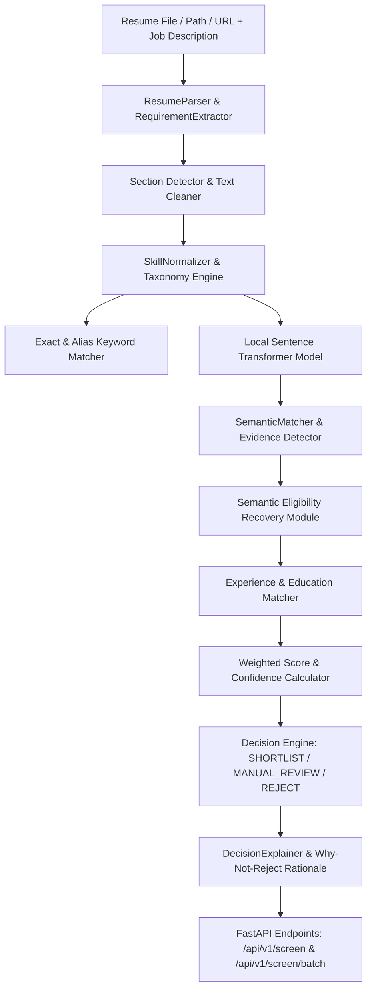

# AI Resume Screening & Semantic Job Matching Engine

A 100% self-hosted, open-source **AI Engine for Resume Screening & Semantic Job Matching** built with **FastAPI**, **Pydantic**, **PyMuPDF**, and **Sentence-Transformers** (`all-MiniLM-L6-v2`).

---

## 🎯 Flexible Resume Input Options

The API endpoint (`POST /api/v1/screen`) supports **all 3 input modes** dynamically:

1. **File Upload** (`resume_file` via `multipart/form-data` binary upload):
   - Best when a recruiter uploads a PDF/DOCX file directly from their browser or Java Spring Boot backend.
2. **File Path String** (`resume_path` string form parameter):
   - Best when the resume file is stored on local disk (e.g. `C:/uploads/resume.pdf`).
3. **URL String** (`resume_url` string form parameter):
   - Best when the resume is stored in cloud storage (AWS S3, GCS) or accessible via HTTP/HTTPS link.

---

## 📐 System Architecture



---

## 📡 API Usage Examples

### 1. File Upload (Multipart Form)
```bash
curl -X POST "http://127.0.0.1:8000/api/v1/screen" \
  -F "resume_file=@data/resumes/candidate_sam_taylor.txt" \
  -F "job_description=Software Developer with 2+ years of experience in Python, React.js, SQL and REST APIs."
```

### 2. File Path String
```bash
curl -X POST "http://127.0.0.1:8000/api/v1/screen" \
  -F "resume_path=C:/Users/devra/.gemini/antigravity/scratch/ai_resume_screener/data/resumes/candidate_sam_taylor.txt" \
  -F "job_description=Software Developer with 2+ years of experience in Python, React.js, SQL and REST APIs."
```

### 3. URL String
```bash
curl -X POST "http://127.0.0.1:8000/api/v1/screen" \
  -F "resume_url=https://example.com/resumes/candidate_sam_taylor.pdf" \
  -F "job_description=Software Developer with 2+ years of experience in Python, React.js, SQL and REST APIs."
```

---

## 🚀 Installation & Local Setup (Windows)

```powershell
cd C:\Users\devra\.gemini\antigravity\scratch\ai_resume_screener
python -m venv .venv
.\.venv\Scripts\pip.exe install -r requirements.txt
.\.venv\Scripts\python.exe run.py
```
- Interactive Swagger UI: `http://127.0.0.1:8000/docs`
